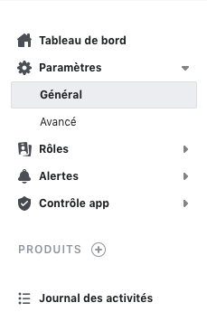
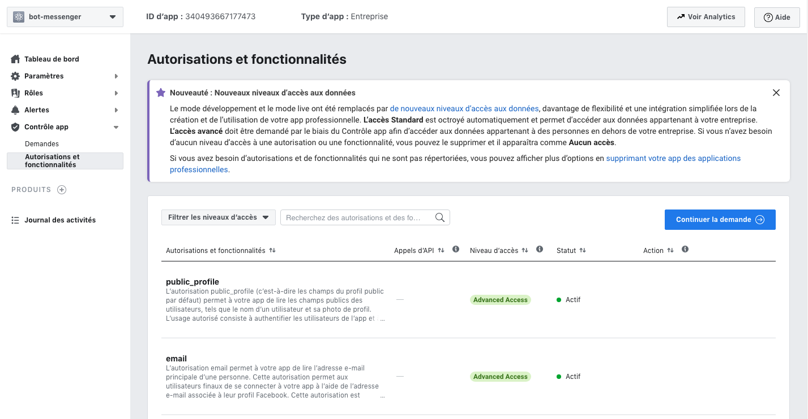

# Introduction

Salut, bienvenue dans ce tutoriel consacré à la **plateforme Messenger**. Tout au long de ce tutoriel je vais essayer de vous présenter comment intégrer un bot Messenger à votre page. Pour atteindre notre objectif nous allons utiliser la base de code fournit dans la documentation officiel :  **Original Coast Clothing**

# Pré-requis

Pour pouvoir suivre ce tutoriel, les pré-requis suivants sont nécessaire :

 - **Avoir une page Facebook** :

 
 - **Avoir un compte developper Facebook**:
Est requis pour créer de nouvelles applications, qui sont au cœur de toute intégration Facebook. Vous pouvez créer un nouveau compte développeur en accédant  [en cliquant ici](https://developers.facebook.com/)

 - **Avoir créer une application** 
L'application contient les paramètres de votre automatisation Messenger, y compris les jetons d'accès. Pour créer une nouvelle application, [cliquez ici](https://developers.facebook.com/apps)

## Créer une page Facebook

Elle Sera utilisée comme identité de votre expérience de messagerie. Lorsque les gens discutent avec votre page. 
Pour créer une nouvelle page [cliquez ici](https://www.facebook.com/pages/create)
Suivez les étapes suivantes si vous avez les difficultés :

 1. Choisir le type de page 

 2. Renseigner les informations de la page (nom, adresse, numéro de téléphone, catégorie )

 3. Personnaliser la page avec une icon et une bannière. 

## Créer un compte développeur

Le compte développeur est requis pour créer les nouvelles applications qui sont au cœur de toute intégration Facebook. 
Vous pouvez créer un nouveau compte développeur en accédant  [en cliquant ici](https://developers.facebook.com/)

## Créer une application 

Nous allons maintenant procéder à la création d'une application depuis notre compte développeur. 

 1. Accéder au compte développeur 

Connectez-vous à votre compte [en cliquant ici](https://developers.facebook.com/). Si vous n'avez pas encore un compte, créez-en. 

 2. Cliquer sur créer une application 

  Lorque que vous vous connectez, vous tomberez sur cette page contenant ce bouton pour créer une nouvelle application.
  

   En cliquant sur new app, ce formulaire s'ouvrira vous demandans des précisions sur 
   l'utilisation que vous allez faire de votre application. Dans cette page nous choisirons la première option (Gérer les intégrations professionnelles) 

   

   En suite créer l'id de l'application en remplissant le formulaire suivant. 

   

   Renseigner le nom d'usage de l'application et le but de votre application. Comme but, nous allons choisir (Vous même et votre entreprise). Après cette étape, vous tomberez sur cette interface. 

   

## Ajouter le produit messenger à notre application.

   - **Rechercher product au niveau du menu lattéral**  
   
   Cliquer sur product pour pouvoir sélectionner le produit que nous voulons ajouter à notre application : Dans notre cas c'est le produit Messenger.

   - **Authorisation et fonctionnalité**  
   Une fois le produit messenger ajouté vous devez demander certaine authorisation et certaines fonctionnalité en fonction de ce que vous voulez faire avec votre application. Dans notre cas, nous allons demande la fonctionnalité (pages_messaging).L’autorisation pages_messaging permet à votre app de gérer les conversations de Page et d’y accéder dans Messenger.
   
   
## Ajouter le produit messenger à notre application.

Après toutes les étapes précédentes, nous allons recupérer le : 
App id : L'identifiant unique de votre application 
Le secret 
Optener ça dans les paramètre généraux de votre application et noter ces deux informations.

## Place au code

Nous allons commencer cette partie en clonant me repos : [Original Coast Clothing (OC)](https://github.com/fbsamples/original-coast-clothing) 
Original Coast Clothing (OC) est une marque de vêtements fictive créée pour présenter les principales caractéristiques de la plateforme Messenger. OC exploite des fonctionnalités clés pour offrir une excellente expérience client. Nous allons utiliser cette base de code dans le cadre de ce tutoriel.

 - **Commençons par cloner le projet**

    $ git clone git@github.com:fbsamples/original-coast-clothing.git
    $ cd original-coast-clothing

 - **Modifier le paramètre d'environnement**
Après avoir cloner le projet, ouvrez le dans votre éditeur favoris, et rechercher le fichier **.sample.env** se trouvant dans la racine du projet. 

Renommons le fichier sample.env en .env.
Ensuiste nous allons modifier les contenu de ce fichier comme suite : 
PAGE_ID : Identifiant de la page que vous avez créée 
APP_ID : Identité de l'application que nous avons créer 
PAGE_ACCESS_TOKEN : 

 
 - **Configurer une tunnel local**
